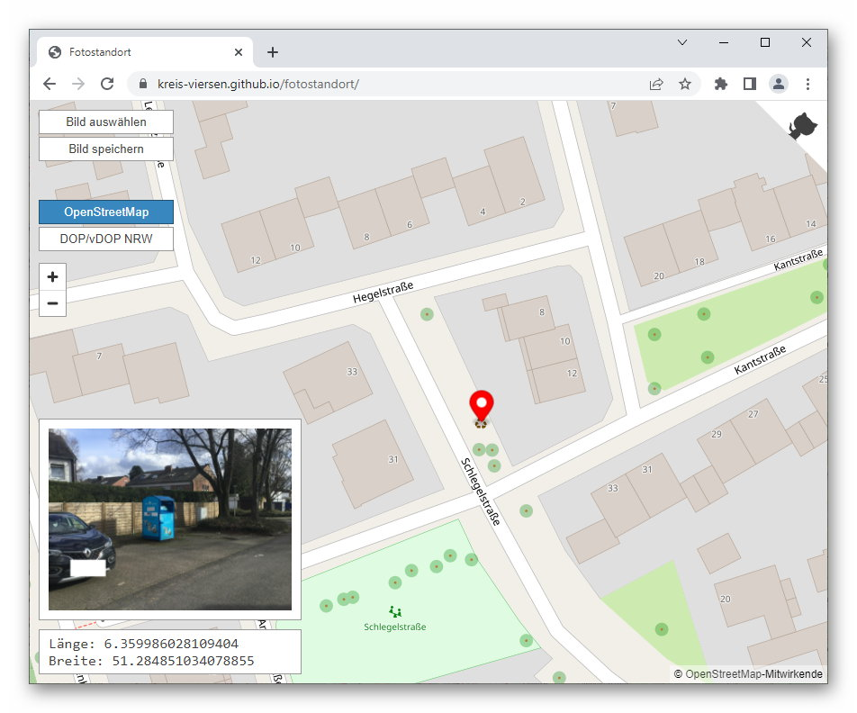

# Fotostandort
Browsertool zum Verändern/Setzen des Fotostandorts (JPEG / EXIF-Daten)

## Features
- Bildposition wird durch Marker auf der Karte angezeigt, Veränderung der EXIF-Positionsdaten erfolgt durch Verschieben des Markers - anschließend kann das veränderte Bild gespeichert werden.
- Wenn keine Koordinaten im Bild vorhanden sind, wird eine entsprechende Meldung angezeigt und es kann ein Standort mittels Marker gesetzt werden.
- Hintergrund OpenStreetMap oder Luftbild ([DOP/vDOP von Geobasis NRW](https://www.bezreg-koeln.nrw.de/brk_internet/geobasis/luftbildinformationen/aktuell/digitale_orthophotos/index.html)).
- Das Bild wird lokal geladen und modifiziert (kein Upload auf irgendeinen Server).

