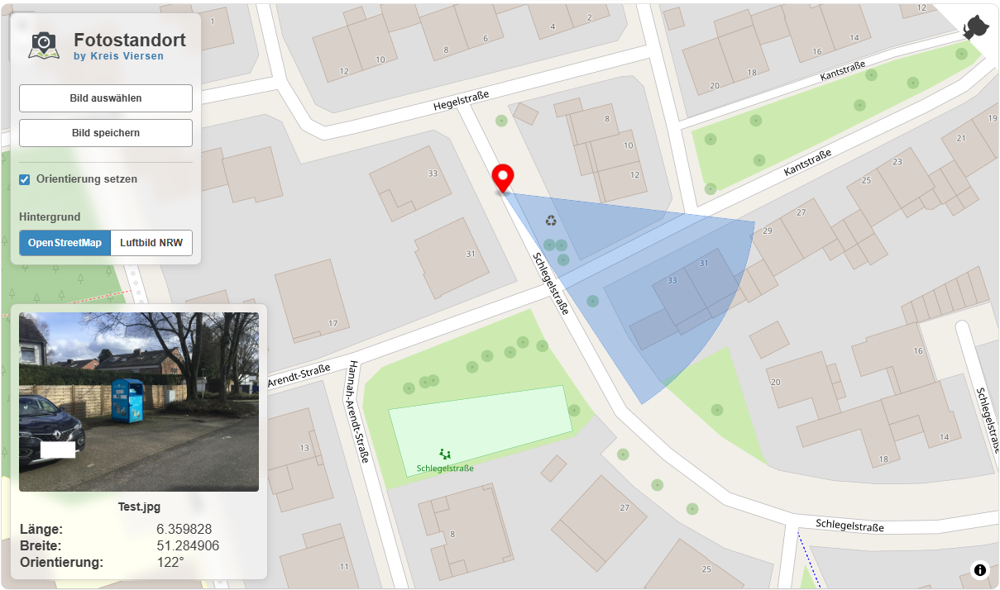
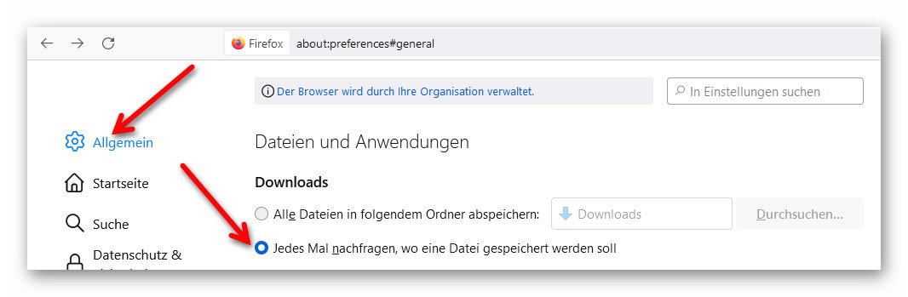
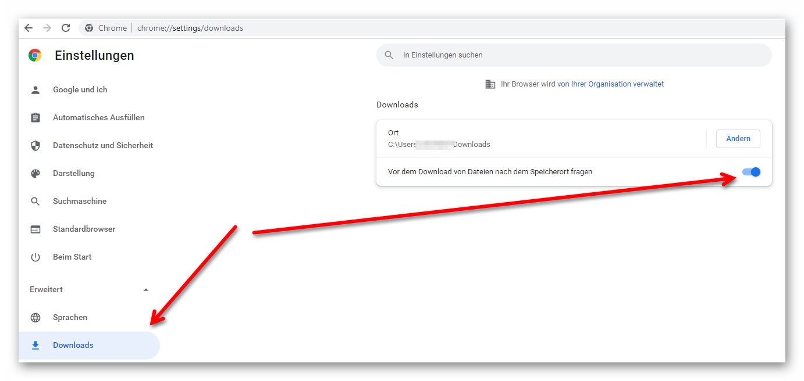
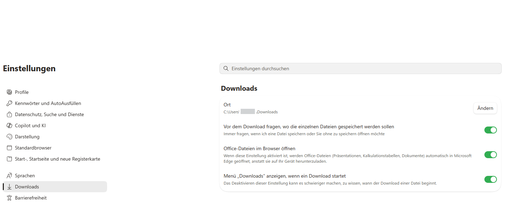

#  Fotostandort

[][github-action-ci]
[][license]

[github-action-ci]: https://github.com/kreis-viersen/fotostandort/actions?query=workflow%3Aci
[license]: https://tldrlegal.com/license/mit-license

**Browsertool zum Anzeigen, Verändern und Setzen der Position und Ausrichtung einer Fotoaufnahme**

**Zur Anwendung:**  
https://kreis-viersen.github.io/fotostandort/

[Fotostandort](https://kreis-viersen.github.io/fotostandort/) ist eine vom Kreis Viersen entwickelte Kartenanwendung, mit der die in einem Foto gespeicherte Aufnahmeposition und Blickrichtung angezeigt und verändert werden können. Fehlen diese Informationen, können sie neu gesetzt werden.

Die Bearbeitung erfolgt vollständig lokal im Webbrowser. Bilder werden nicht auf einen Server hochgeladen.

## Verwendung

1. Über `Bild auswählen` ein Bild vom lokalen Gerät laden.
2. Fotostandort liest die vorhandenen EXIF-Daten zu Position und Orientierung aus.
3. Darstellung
    - Die Aufnahmeposition wird als Marker auf der Karte dargestellt.
    - Die Orientierung kann (_optional_) als Sichtkegel dargestellt werden.
4. Verändern / Setzen von Position und Orientierung
    - Per Drag-and-Drop des Markers kann die Position verändert werden.
    - Durch Drehen des Sichtkegels kann die Orientierung verändert werden.
    - Die ursprünglichen sowie die aktuell gesetzten Werte werden unter der Bildvorschau angezeigt.
5. Über `Bild speichern` wird das Bild mit den aktualisierten EXIF-Daten lokal gespeichert.

## Bildformate

Die Anwendung unterstützt verschiedene gängige Bildformate.

Bilder, die nicht im JPEG-Format vorliegen, werden beim Laden automatisch in das JPEG-Format konvertiert. Das bearbeitete Bild wird anschließend als JPEG gespeichert.

## Mobile Nutzung

[Fotostandort](https://kreis-viersen.github.io/fotostandort/) ist auch für die Nutzung auf Smartphones und Tablets geeignet.

Position und Orientierung können auf Touch-Geräten direkt in der Karte bearbeitet werden. Der Marker lässt sich mit dem Finger verschieben und der Sichtkegel durch eine Drehbewegung anpassen.

Auf kleineren Bildschirmen werden die Bedienelemente platzsparend dargestellt. Das Bedienfeld sowie die Bildvorschau können ein- und ausgeklappt werden, sodass möglichst viel Platz für die Kartenansicht zur Verfügung steht.

## Kartenhintergründe

In der Anwendung kann zwischen verschiedenen Kartenhintergründen gewählt werden. Aktuell implementiert sind

- [OpenStreetMap](https://www.openstreetmap.org/)
- [aktuelle Luftbilder von Geobasis NRW (DOP/vDOP)](https://www.bezreg-koeln.nrw.de/geobasis-nrw/produkte-und-dienste/luftbild-und-satellitenbildinformationen/aktuelle-luftbild-und-0)

## Datenschutz

Die Verarbeitung der Bilder erfolgt vollständig lokal im Webbrowser.

Das ausgewählte Bild und dessen EXIF-Daten werden **nicht an einen Server übertragen**.

## Feedback und Fehler

Fragen, Anmerkungen, Fehlermeldungen etc. können über einen [GitHub-Issue](https://github.com/kreis-viersen/fotostandort/issues) oder auch gerne per E-Mail an [open@kreis-viersen.de](mailto:open@kreis-viersen.de?subject=Fotostandort) mitgeteilt werden.

## Weitere Informationen

- [Fotostandort öffnen](https://kreis-viersen.github.io/fotostandort/)
- [Releases / Changelog](https://github.com/kreis-viersen/fotostandort/releases)

## Lizenz

Fotostandort steht unter der [MIT-Lizenz](LICENSE) als Open-Source-Software zur Verfügung.

Das in der Anwendung verwendete openCode-Logo ist nicht Bestandteil dieser Lizenz. Die Verwendung des Logos erfolgt mit freundlicher Genehmigung von [openCode](https://opencode.de/) und unterliegt dem Markenrecht.

## Einstellung Speicherort Webbrowser

Standardmäßig wird ein Bild beim Klick auf `Bild speichern` im Download-Ordner abgelegt. Um den Speicherort selbst festzulegen, müssen Sie eine entsprechende Abfrage in den Einstellungen Ihres Browsers aktivieren. 

### Firefox

### Chrome

### Edge
